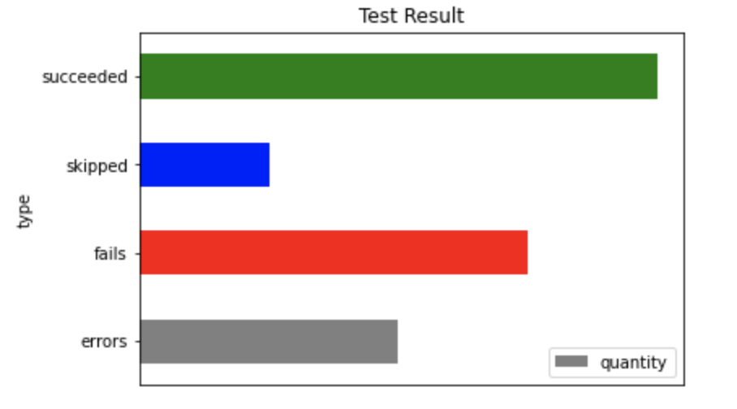
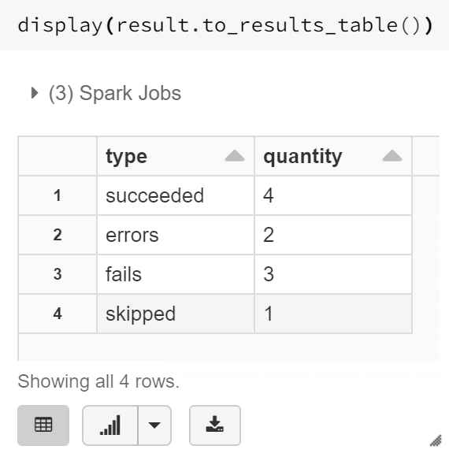
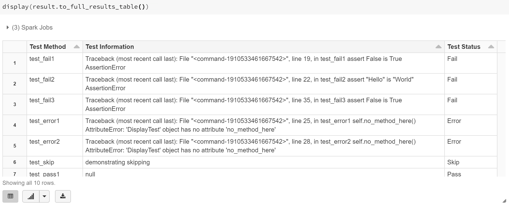
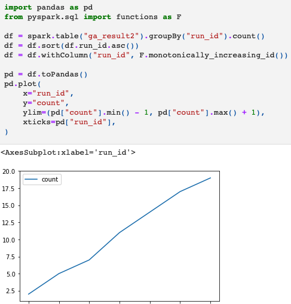
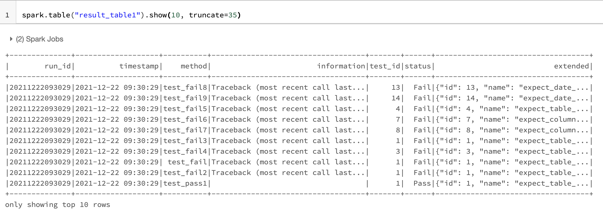

Great Assertions
================

|serialbandicoot| |flake8 Lint| |codecov| |CodeQL|

This library is inspired by the Great Expectations library. The library
has made the various expectations found in Great Expectations available
when using the inbuilt python unittest assertions.

Install
-------

.. code:: bash

    pip install great-assertions

Code example Pandas
-------------------

.. code:: python

    from great_assertions import GreatAssertions
    import pandas as pd

    class GreatAssertionTests(GreatAssertions):
        def test_expect_table_row_count_to_equal(self):
            df = pd.DataFrame({"col_1": [100, 200, 300], "col_2": [10, 20, 30]})
            self.expect_table_row_count_to_equal(df, 3)

Code example PySpark
--------------------

.. code:: python

    from great_assertions import GreatAssertions
    from pyspark.sql import SparkSession

    class GreatAssertionTests(GreatAssertions):

        def setUp(self):
            self.spark = SparkSession.builder.getOrCreate()

        def test_expect_table_row_count_to_equal(self):
            df = self.spark.createDataFrame(
                [
                    {"col_1": 100, "col_2": 10},
                    {"col_1": 200, "col_2": 20},
                    {"col_1": 300, "col_2": 30},
                ]
            )
            self.expect_table_row_count_to_equal(df, 3)

List of available assertions
----------------------------

+--------------------------------------------------+---------------------+---------------------+
|                                                  | Pandas              | PySpark             |
+==================================================+=====================+=====================+
| expect_table_row_count_to_equal                  | :white_check_mark:: | :white_check_mark:: |
+--------------------------------------------------+---------------------+---------------------+
| expect_table_row_count_to_be_greater_than        | :white_check_mark:: | :white_check_mark:: |
+--------------------------------------------------+---------------------+---------------------+
| expect_table_row_count_to_be_less_than           | :white_check_mark:: | :white_check_mark:: |
+--------------------------------------------------+---------------------+---------------------+
| expect_table_has_no_duplicate_rows               | :white_check_mark:: | :white_check_mark:: |
+--------------------------------------------------+---------------------+---------------------+
| expect_column_value_to_equal                     | :white_check_mark:: | :white_check_mark:: |
+--------------------------------------------------+---------------------+---------------------+
| expect_column_values_to_be_between               | :white_check_mark:: | :white_check_mark:: |
+--------------------------------------------------+---------------------+---------------------+
| expect_column_values_to_match_regex              | :white_check_mark:: | :white_check_mark:: |
+--------------------------------------------------+---------------------+---------------------+
| expect_column_values_to_be_in_set                | :white_check_mark:: | :white_check_mark:: |
+--------------------------------------------------+---------------------+---------------------+
| expect_column_values_to_be_of_type               | :white_check_mark:: | :white_check_mark:: |
+--------------------------------------------------+---------------------+---------------------+
| expect_table_columns_to_match_ordered_list       | :white_check_mark:: | :white_check_mark:: |
+--------------------------------------------------+---------------------+---------------------+
| expect_table_columns_to_match_set                | :white_check_mark:: | :white_check_mark:: |
+--------------------------------------------------+---------------------+---------------------+
| expect_date_range_to_be_more_than                | :white_check_mark:: | :white_check_mark:: |
+--------------------------------------------------+---------------------+---------------------+
| expect_date_range_to_be_less_than                | :white_check_mark:: | :white_check_mark:: |
+--------------------------------------------------+---------------------+---------------------+
| expect_date_range_to_be_between                  | :white_check_mark:: | :white_check_mark:: |
+--------------------------------------------------+---------------------+---------------------+
| expect_column_mean_to_be_between                 | :white_check_mark:: | :white_check_mark:: |
+--------------------------------------------------+---------------------+---------------------+
| expect_column_value_counts_percent_to_be_between | :white_check_mark:: | :white_check_mark:: |
+--------------------------------------------------+---------------------+---------------------+
| expect_frame_equal                               | :white_check_mark:: | :white_check_mark:: |
+--------------------------------------------------+---------------------+---------------------+
| expect_column_has_no_duplicate_rows              | :white_check_mark:: | :white_check_mark:: |
+--------------------------------------------------+---------------------+---------------------+
| expect_column_value_to_equal_if                  | :white_check_mark:: | :white_check_mark:: |
+--------------------------------------------------+---------------------+---------------------+
| expect_column_value_to_be_greater_if             | :white_check_mark:: | :white_check_mark:: |
+--------------------------------------------------+---------------------+---------------------+

Assertion Descriptions
----------------------

For a description of the assertions see `Assertion
Definitions <docs/assertion_definitions.md>`__

Running the tests
-----------------

Executing the tests still require unittest, the following options have
been tested with the examples provided.

Option 1
~~~~~~~~

.. code:: python

    import unittest
    suite = unittest.TestLoader().loadTestsFromTestCase(GreatAssertionTests)
    runner = unittest.TextTestRunner(verbosity=2)
    runner.run(suite) 

Options 2
~~~~~~~~~

.. code:: python

    if __name__ == '__main__':
        unittest.main()   

Pie Charts and Tables
---------------------

For a more visual representation of the results, when using in Databricks or Jupyter Notebooks. 
The results can be outputted as tables or pie-chart.

.. code:: python

    import unittest
    from great_assertions import GreatAssertionResult, GreatAssertions

    class DisplayTest(GreatAssertions):
        def test_pass1(self):
            assert True is True

        def test_fail(self):
            assert "Hello" == "World"    

    suite = unittest.TestLoader().loadTestsFromTestCase(DisplayTest)
    test_runner = unittest.runner.TextTestRunner(resultclass = GreatAssertionResult)
    result = test_runner.run(suite)

    result.to_barh() #Also available: result.to_pie()

.. code:: python

    result.to_results_table()

.. code:: python

    result.to_full_results_table()

Runnng with XML-Runner
----------------------

To run with xml-runner, there is no difference to how it's currently used. 
However you will not be able to get method like to_results_table as these use a different `resultclass`   

.. code:: python

    import xmlrunner
    suite = unittest.TestLoader().loadTestsFromTestCase(DisplayTest)
    test_runner = xmlrunner.XMLRunner(output="test-results")
    test_runner.run(suite)

Production Monitoring
---------------------

The assertions provided by GA will also allow the validation of the any environment including Production. 
Currently GA only supports saving the results to Spark, for example databricks.

Once the run has completed there is a `save` method, as seen below.

.. code:: python

    import xmlrunner
    suite = unittest.TestLoader().loadTestsFromTestCase(DisplayTest)
    test_runner = xmlrunner.XMLRunner(output="test-results")
    result = test_runner.run(suite)
    result.save(format="databricks")

The image below shows a simple graph of the accumulation of tests over test run. 
However much more complex analysis can be performed with the extended data being generated by GA.

The extended table of results contains the following:

+--------------+-------------------+----------+-----------------------------------+-------+------+---------------------------------------------------------------------------------------------------------------------------------------+
|        run_id|          timestamp|    method|                        information|test_id|status|                                                                                                                               extended|
+--------------+-------------------+----------+-----------------------------------+-------+------+---------------------------------------------------------------------------------------------------------------------------------------+
|20211222093029|2021-12-22 09:30:29|test_fail8|Traceback (most recent call last...|     13|  Fail|{"id": 13, "name": "expect_date_range_to_be_less_than", "values": {"expected_max_date": "2019-05-13", "actual_max_date": "2019-05-13"}}|
+--------------+-------------------+----------+-----------------------------------+-------+------+---------------------------------------------------------------------------------------------------------------------------------------+
|20211222093029|2021-12-22 09:30:29|test_fail9|Traceback (most recent call last...|     14|  Fail|{"id": 14, "name": "expect_date_range_to_be_more_than", "values": {"expected_min_date": "2015-10-01", "actual_min_date": "2015-10-01"}}|
+--------------+-------------------+----------+-----------------------------------+-------+------+---------------------------------------------------------------------------------------------------------------------------------------+

From the extended column you can get further details about the type test, which was executed and the results. 
For example if we look at the test `expect_table_row_count_to_be_less_than` we should assert that the max row should not be breached. 

In the code below, the expected was 100 and the actual was 205, which caused the test to fail. 
Therefore Analysts can query the extended data to get a picture of the size of the breach.

.. code:: python

    extended = {
        "id": 2,
        "name": expect_table_row_count_to_be_less_than,
        "values": {
            "exp_max_count": 100,
            "act_count": 205,
        },
    }

In production monitoring these types of results can allow the prevention of skewed results. 
For example, if you had a result, where the expected values were withing a range of 0-100 
and you got an exceptionally large value. 

The large value could cause business functionality to be skewed such that a defect could causes 
damage or loss of income or incorrect reporting to a downstream system.

Therefore, GA will allow you to provide benchmarks to the production validation and an 
experienced analyst can create reports on top of the data.

An example of the extended dataset:

Notes
-----

If you get an arrows function warning when running in Databricks, this will happen 
because a toPandas() method is being used for many of the assertions. The plan is 
to remove Pandas conversion for pure PySpark code. If this is an issue, please raise 
an issue so this method can be prioritised. For now, it’s advisable to make sure the 
datasets are not too big, which cause the driver to crash.

Development
-----------

To create a development environment, create a virtualenv and make a
development installation

::

    virtualenv ve
    source ve/bin/activate

To run tests, just use pytest

::

    (ve) pytest     

.. |serialbandicoot| image:: https://circleci.com/gh/serialbandicoot/great-assertions.svg?style=svg
   :target: LINK
.. |flake8 Lint| image:: https://github.com/serialbandicoot/great-assertions/actions/workflows/flake8.yml/badge.svg
   :target: https://github.com/serialbandicoot/great-assertions/actions/workflows/flake8.yml
.. |codecov| image:: https://codecov.io/gh/serialbandicoot/great-assertions/branch/master/graph/badge.svg?token=OKBB0E5EUC
   :target: https://codecov.io/gh/serialbandicoot/great-assertions
.. |CodeQL| image:: https://github.com/serialbandicoot/great-assertions/workflows/CodeQL/badge.svg
   :target: https://github.com/serialbandicoot/great-assertions/actions?query=workflow%3ACodeQL

